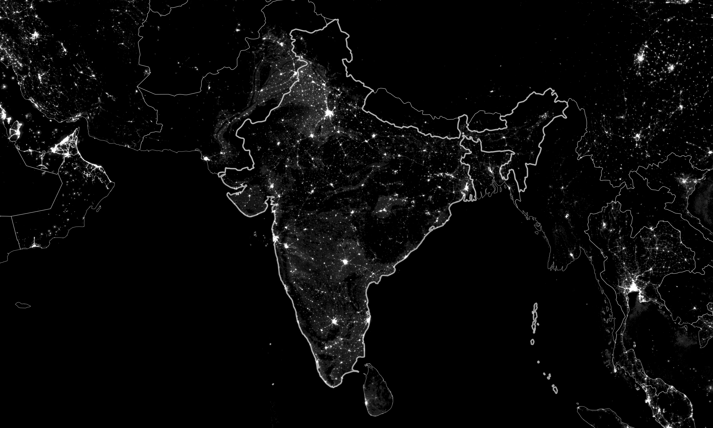

## [Get the Data](http://api.nightlights.io)
The data from this platform is open-source. It can be accessed from the [India Lights API](http://api.nightlights.io).

## Twenty years of India Lights
The India Lights platform shows light output at night for 20 years for 600,000 villages across India. The Defense Meteorological Satellite Program (DMSP) has taken pictures of the Earth every night from 1993 to 2013. Researchers at the University of Michigan, in collaboration with the World Bank, used the DMSP images to extract the data you see on the India Lights platform. Each point you see on the map represents the light output of a specific village at a specific point in time. On the district level, the map also allows you to filter to view villages that have participated in India’s flagship electrification program (you can read more about it [here](#/stories/rggvy)). This tremendous trove of data can be used to look at changes in light output, which can be used to complement research about electrification in the country.

*Composite of night light imagery from [DMSP](http://ngdc.noaa.gov/eog/dmsp/downloadV4composites.html), 2013*

## The Data
The DMSP raster images have a resolution of 30 arc-seconds, equal to roughly 1 km2 at the equator. Each pixel of the image is assigned a number on a relative scale from 0 to 63, with 0 indicating no light output and 63 indicating the highest level of output. This number is relative and may change depending on the gain settings of the satellite’s sensor, which constantly adjusts to current conditions as it takes pictures throughout the day and at night.

## Methodology
To derive a single measurement, the light output values were extracted from the raster image for each date for the pixels that correspond to each village's approximate latitude and longitude coordinates. We then processed the data through a series of filtering and aggregation steps.

First, we filtered out data with too much cloud cover and solar glare, according to recommendations from the National Oceanic and Atmospheric Administration (NOAA). We aggregated the resulting 4.4 billion data points by taking the median measurement for each village over the course of a month. We adjusted for differences among satellites using a multiple regression on year and satellite to isolate the effect of each satellite. To analyze data on the state and district level, we also determined the median village light output within each administrative boundary for each month in the twenty-year time span.  These monthly aggregates for each village, district, and state are the data that we have made accessible through the [API](http://api.nightlights.io).

To generate the map and light curve visualizations that are presented on this site, we performed some additional data processing. For the light curves, we used a rolling average to smooth out the noise due to wide fluctuations inherent in satellite measurements. For the map, we took a random sample of 10% of the villages, stratified over districts to ensure good coverage across regions of varying village density.

## Acknowledgments
The India Lights project is a collaboration between [Development Seed](https://developmentseed.org), [The World Bank](http://www.worldbank.org/), and [Dr. Brian Min](http://www-personal.umich.edu/~brianmin/) at the University of Michigan.

 - India village locations derived from India VillageMap © 2011-2015 ML Infomap.
 - India population data and district boundaries © 2011-2015 ML Infomap.
 - Data for reference map of Uttar Pradesh, India, from [Natural Earth Data](www.naturalearthdata.com/downloads/)
 - Banerjee, Sudeshna Ghosh; Barnes, Douglas; Singh, Bipul; Mayer, Kristy; Samad, Hussain. 2014. [Power for all : electricity access challenge in India. A World Bank study](https://github.com/mapbox/mapbox-gl-js/issues/1270). Washington, DC ; World Bank Group.
 - Hsu, Feng-Chi, Kimberly Baugh, Tilottama Ghosh, Mikhail Zhizhin, and Christopher Elvidge. "DMSP-OLS Radiance Calibrated Nighttime Lights Time Series with Intercalibration." Remote Sensing 7.2 (2015): 1855-876. Web.
 - Min, Brian. Monitoring Rural Electrification by Satellite. Tech. World Bank, 30 Dec. 2014. Web.
 - Min, Brian. Power and the Vote: Elections and Electricity in the Developing World. N.p.: Cambridge UP, Print. To be published in September 2015.
 - Min, Brian, and Kwawu Gaba. "Tracking Electrification in Vietnam Using Nighttime Lights." Remote Sensing 6.10 (2014): 9511-529. Web.

## Disclaimer

Country borders or names do not necessarily reflect the World Bank Group's official position. [The map](#/) is for illustrative purposes and does not imply the expression of any opinion on the part of the World Bank, concerning the legal status of any country or territory or concerning the delimitation of frontiers or boundaries.
